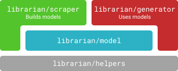

# Librarian

Librarian is a modular toolkit to programmatically work with software libraries.
This is the main entrypoint module for the librarian project.
It offers a unified CLI for all the features of the librarian project and contains a unified REPL environment for development purposes.
Librarian consists of the following submodules:

<p align=center></p>

*   [`librarian/model`](./modules/model): A tool to build abstract models of language ecosystems. It comes with a model for Python but can also be used to describe other ecosystems. It additionally offers a uniform interface to read, write and query facts about a given ecosystem (e.g. the names of the classes in a particular Python namespace). Such collections of model facts are called *scrapes*.
*   [`librarian/scraper`](./modules/scraper): A tool that crawls the documentation of software libraries and produces library scrapes. The scraped information is validated and categorized using a `librarian/model` ecosystem.
*   [`librarian/generator`](./modules/generator): A tools that automatically generates source code from a given library scrape and a user request. 
*   [`librarian/helpers`](./modules/helpers): A collection of various general-purpose helpers that are used by the other librarian modules.

Librarian also comes with a prebuilt scrape for scikit-learn in [`libs/scikit-learn`](./libs/scikit-learn/scraper.clj).

## 1. Getting Started

1.  To work on the Librarian modules, at least basic knowledge of [Clojure](https://clojure.org/) is required.
2.  To setup your development environment for Clojure, the following tools are required:
	-   [Leiningen (2.8)](https://leiningen.org/) as the build tool.
	-   An editor or IDE that works well with Clojure, e.g.:
		-   **Atom** with [proto-repl](https://github.com/jasongilman/proto-repl), [Paredit](https://github.com/jonspalding/lisp-paredit), [Parinfer](https://github.com/oakmac/atom-parinfer) and the [joker linter](https://github.com/candid82/joker).
			See [this setup guide](https://gist.github.com/jasongilman/d1f70507bed021b48625).
			*Note:*
			Librarian comes with some convenience helpers to [visualize](https://github.com/jasongilman/proto-repl-charts) results that currently only work on Atom.
		-   **VS Code** with [Calva](https://github.com/BetterThanTomorrow/calva).
		-   [**Cursive IDE**](https://cursive-ide.com/)
		-   Obviously [vim](https://github.com/tpope/vim-fireplace) and [emacs](https://cider.mx/) are also well supported.
3.  The Librarian modules were built around [Datascript](https://github.com/tonsky/datascript), a lightweight in-memory database, that is used to store and access the scraped facts about libraries.
	It is recommended to get a basic understanding of Datascript before continuing.
4.  To understand how the Librarian modules work and interact with each other, take a look at the module documentation.
	The recommended reading order is:
	1.  [`librarian/model`](./modules/model/README.md):
		The introduction and section 1 are most relevant in the first step.
	2.  [`librarian/scraper`](./modules/scraper/README.md):
		To get a basic idea of how the scraper works, the [architecture overview](./modules/scraper/docs/architecture.md) should be read first.
		For a guide on how to actually use and work on the scraper in practice, the main [README](./modules/scraper/README.md) can be consulted afterwards.
	3.  [`librarian/generator`](./modules/generator/README.md):
		Similar to the scraper, the [architecture overview](./modules/generator/docs/architecture.md) should be read first.
		The main [README](./modules/generator/README.md) then describes how to actually use the generator.
5.  To work on the Librarian modules, see [section 4](#4-starting-a-development-repl) for instructions on how to start an interactive REPL environment.
6.  To play around with the Librarian modules, you can use the builtin REPL helpers for the [scraper](./modules/scraper/README.md#3-development-repl) and the [generator](./modules/generator/README.md#23-development-repl).
	Start by reproducing the example REPL interactions and continue from there.
		
## 2. Installation

Librarian is written in Clojure but it also offers a [Java interface](./modules/generator/README.md#22-java-applications).
If you just want to install the modules to your local Maven repo, simply run:
```shell
mvn install
```

## 3. Build

To build the Librarian-CLI simply run:
```shell
lein uberjar # Creates an executable jar at bin/librarian.jar
```

The resulting JAR can be used via the comamnd line.
It is an interface to the [scraper](./modules/scraper) and to some parts of the [model](./modules/model).

To see all available commands run `java -jar bin/librarian.jar -?`.
To get more information about a specific command run `java -jar bin/librarian.jar [cmd] -?`.

The CLI commands are documented in more detail in the [README of the scraper](./modules/scraper/README.md#2-querying-a-scraped-library-via-the-cli).

## 4. Starting a development REPL

If you want to work on Librarian you will need [Leiningen 2.8](https://leiningen.org/).
Librarian is structured as a [multimodule](https://github.com/jcrossley3/lein-modules) project.
To set up your environment, run:
```shell
lein prepare-repl
# This is a shorthand alias for the following:
# - Installs all modules to your local repo. (lein modules install)
# - Deletes target-dirs from modules. (lein modules clean)
# - Creates Leiningen checkouts. (lein modules :checkouts)
```
Using [checkouts](https://github.com/technomancy/leiningen/blob/stable/doc/TUTORIAL.md#checkout-dependencies) you can test changes across multiple modules without having to reinstall them to your local repo after each change.
The cleaning step is required for hot-code reloading via [clojure.tools.namespace](https://github.com/clojure/tools.namespace) in the REPL.

To get a REPL, just run `lein repl`.
Module specific details are described in the READMEs of the individual modules (linked above).

For simple interoperability with Maven all the Librarian modules also come with an automatically generated pom file.
Those pom files are shipped with Librarian to allow users to integrate Librarian into pure Maven projects without having to install Leiningen or other Clojure specific tooling. 
Please remember to run `lein modules pom` after adding, removing or updating a dependency of a module to update the generated pom files.
Only the `project.clj` files should be edited manually, the pom files should always be auto-generated to guarantee consistency between Maven and Leiningen.

## 5. Future tasks

The following tasks should be considered in the future.
They are categorized by their importance for the long-term goals of IDA.

-   [x] Develop a universal model to represent software libraries.
-   [x] Develop a tool to automatically build models of libraries from their online documentation.
-   [x] Develop an uninteractive code generator that takes user requirements and a library model and finds source code that satisfies the user's requirements.
-   [ ] **HIGH** Make the code generator **interactive**, i.e. make the user part of the search loop to allow for additional input and clarification during the code generation process. Currently the generator picks whatever it deems to be the most probable choice if there is ambiguity in the user requirements. Multiple parts of the generator need to be extended for this but the core of the current uninteractive A* loop is implemented [here in `search`](modules/generator/src/librarian/generator/generate.clj). Instead of using a tight `iterate` loop to go from one search state to the next, the generator should be able to detect uncertainty (possible via the [cost model](modules/generator/docs/architecture.md#cost-and-heuristic-model)) and allow a third-party (the user) to modify the search state to resolve the uncertainty. Afterwards the search loop can continue until the next point of high uncertainty is reached.
-   [ ] **HIGH** The code executor provided by the `:python` ecosystem model is currently very rudimentary and not capable of handling big loads and of playing nicely in a distributed micro-service architecture, since code is currently just executed in a Python child process of the calling process. Ideally Librarian should be able to automatically generate *"executor" Docker containers* from scrape configurations which would accept code, execute it and respond with the execution result. Those automatically generated containers would allow code execution to be **scaled and distributed**. The container configuration could be done via the currently unused `:meta` attribute of [scrape configurations](modules/scraper/README.md#4-writing-your-own-scrape-configurations) which was added for exactly such use cases.
-   [ ] **HIGH** Improve the **cost model** of the generator. Currently the compatibility between two semantic types is binary. A more fuzzy similarity-based compatibility measure for the semantics of values should be implemented. See [`librarian.generator.cost`](modules/generator/src/librarian/generator/cost.clj).
-   [ ] **HIGH** Improve the **heuristic function** of the generator. The current heuristic is fairly conservative in order to stay admissible. Without a relatively high weight to make the WA* search more depth-first like, this conservative heuristic would often consider fruitless paths. More research is necessary in order to get more accurate heuristic.
-   [ ] **MEDIUM** Find a way to deal with optional return values (e.g. the [`best_n_iter` return value of `sklearn.cluster.k_means`](https://scikit-learn.org/0.21/modules/generated/sklearn.cluster.k_means.html#sklearn.cluster.k_means)). Currently the WA* approach can cause the generation of unnecessary return value accesses. This can cause problems if a non-existing return value is accessed in dynamic languages. Possible mitigation strategies:
	-   *Simple approach:* Apply a simple CFG simplification step before producing source code by pruning unreturned processing paths. This only works under the assumption that the user does not request a value that is derived from an optional return value.
	-   *Complex approach:* Properly model optional return values in the model with the flexibility to describe the condition on which the value's optionality depends. This would involve an analysis of common scenarios for optional returns as well as an extension of the scrapers capabilities to detect those scenarios. Most likely some kind of NLP would have to be integrated into the scraping phase for this.
-   [ ] **MEDIUM** Consider ways to further improve the **performance of the generator**. The generator already caches multiple types of query results and tries to reuse previous computations if possible. However there are still many opportunities to further reduce redundant computations. It needs to be analyzed which remaining optimizations are feasible. A major candidate to improve performance would be to make the A* search loop multithreaded or possible even parallelize individual search steps (it is however not yet clear whether the resulting overhead would outweigh the benefits).
-   [ ] **LOW** The **CFG visualizations** that are part of the dev tooling for the generator currently only support the Atom editor via [proto-repl](https://github.com/jasongilman/proto-repl). Support for other visualization backends should be added so that other editors and IDEs are usable equally well.
