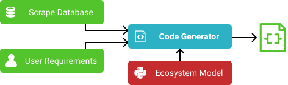
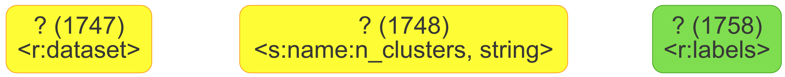

# librarian/generator
<!--lint disable no-shortcut-reference-link-->
<!--lint disable no-undefined-references-->

A tools that automatically generates source code from a given library scrape and a user request. 

<p align=center></p>

**Architecture Overview:**
An introduction to the basic working principle of the generator can be found [here](docs/architecture.md).
It is recommended to start there to get a basic understanding first and then read this usage guide.

## 1. Specifying User Requirements

The syntax to describe user requirements is the same as the [`:snippets` definition syntax](../scraper/README.md#42-snippets-snippets) of the scraper.
The initial state for the A* search performed by the generator is just a partial CFG (i.e. a snippet) that should be completed.

Please read the scraper's [snippet documentation](../scraper/README.md#42-snippets-snippets) first.
Using the requirements snippet one can provide an arbitrarily complex starting point for the generator.
One can only provide the given inputs and required outputs and let the generator fill in the rest or one could provide a nearly complete CFG where only a single parameter value has to be filled in.

User-provided inputs and required outputs of the generated code are specified as follows:
-   **External Inputs:**
	If the user wants to provide some external input to the generated code, e.g. a dataset, the input is specified as a `:call-result` node without an associated call.
	From the perspective of the generator an external input is simply the return value of some unknown callable.
	When converting a CFG to executable code, such `:call-result` nodes are converted to parameters.
	If multiple inputs are provided, they can be ordered by setting the `:position` attribute of the `:call-result` nodes.
-   **Required Outputs:**
	Analogous to external inputs, required outputs are specified as `:call-parameter` nodes without an associated call.
	From the perspective of the generator a required output is simply a parameter of some unknown callable.
	Such `:call-parameter` nodes are converted to return values in the corresponding executable code.
	Multiple required outputs can be ordered via the `:position` attribute of the `:call-parameter` nodes.

**Example:**
```clojure
[;; User-provided inputs:
 {:type :call-result
  :position 0
  :datatype [{:type :role-type
              :id :dataset}]}
 {:type :call-result
  :position 1
  :datatype [{:type :basetype
              :name "string"}
             {:type :semantic-type
              :key "name"
              :value "n_clusters"}]}

 ;; Required outputs:
 {:type :call-parameter
  :datatype [{:type :role-type
              :id :labels}]}]
```

This example requirement is paired with the [scikit-learn library scrape](../../libs/scikit-learn/scraper.clj).
The information about the functions that accept and return the role types `:dataset` and `:labels` is specified in the `:snippets` section of the scrape configuration.

Given the requirements and the scrape, the following initial and final CFGs would follow:

<table border=0>
	<thead>
		<tr>
			<th>Requirement CFG</th>
			<th>Resulting CFG</th>
		</tr>
	</thead>
	<tbody>
		<tr>
			<td></td>
			<td></td>
		</tr>
	</tbody>
</table>

The resulting CFG would be converted to the following Python code by the `:generator` of the [`:python` ecosystem](../model):
```python
import sklearn.cluster

def f(v1748, v1747):
  v968 = "auto"
  v1777 = int(x=v1748)
  v1754 = sklearn.cluster.k_means(
    X=v1747,
    n_clusters=v1777,
    precompute_distances=v968
  )
  v1752 = v1754[1]
  return v1752
```
-   The provided inputs `v1748` (`dataset`) and `v1747` (`n_clusters`) become parameters of the solution function.
Note that the `:position` attributes of the inputs were used to order the parameters of `f`.
-   The required output `v1758` (`labels`) becomes the return value of the solution function.

## 2. Usage Guide

The generator offers three main ways to use it:
1. Usage in Clojure applications
2. Usage in Java applications
3. Usage in a development REPL

### 2.1. Clojure Applications

The core functionality of the generator is provided by [`librarian.generator.core`](src/librarian/generator/core.clj).

-   `(search scrape init-descs limit)`:
	Performs an A* search through the space of CFGs.
	Takes a scrape and the description of an initial CFG in the previously described format, i.e. a vector of instance maps.
	It also takes the maximum number of allowed search steps.
	Returns a solution map if an executable solution could be found within the step limit and `nil` otherwise.
	The solution map contains the following keys:
	-   `:db`: A Datascript database based on the given `scrape` which contains the found final CFG.
	-   `:cost`: The cost of the found solution.
	-   `:last-action`: The action map that led to this solution.
	-   `:predecessor`: The state describing the previous incomplete CFG before `:last-action` was applied.
		The predecessor state is a map with the same schema as the goal state.
		By recursively traversing the `:predecessor` links, the initial state can be reached.
	-   `:flaws`: A map of `:parameter` and `:call` flaws.
		Solution states are defined to have no remaining flaws, i.e. the flaws map is always `{:parameter [], :call []}`.
		The `:predecessor` state will however have have at least one remaining flaw which was fixed by `:last-action`.
-   `(solver solution)`:
	Takes a solution that was found via `(search scrape init-descs limit)` and returns a Clojure function that can be called with the inputs specified in `init-descs`.
-   `(code solution)`:
	Takes a solution that was found via `(search ...)` and returns the executable source code corresponding to the solution CFG.
-   `(search-solver scrape init-descs limit)`:
	Combination of `(search)` and `(solver)`.
	Searches for a solution and returns a solver function for that solution.
-   `(search-code scrape init-descs limit)`:
	Combination of `(search)` and `(code)`.
	Searches for a solution and returns the source code for that solution.

**Example:**
```clojure
(require '[librarian.generator.core :as gen]
		 '[librarian.model.io.scrape :as scrape])

(def solution (gen/search (scrape/read-scrape "libs/scikit-learn")
                          [{:type :call-result
                            :position 0
                            :datatype [{:type :role-type
                                        :id :dataset}]}
                           {:type :call-result
                            :position 1
                            :datatype [{:type :basetype
                                        :name "string"}
                                       {:type :semantic-type
                                        :key "name"
                                        :value "n_clusters"}]}
                           {:type :call-parameter
                            :datatype [{:type :role-type
                                        :id :labels}]}]
                          100))

(code solution)
;; => Returns a string of Python code.

(def solver (gen/solver solution))
;; => Returns a solver function that executes the solution code.

(solver [[0 0] [2 0] [2 1] [0 1]] 2) ; Takes a dataset and n_clusters.
;; => Returns labels obtained via the found solution code, e.g. [0 1 1 0].
```

### 2.2. Java Applications

The generator also offers a Java interop layer, which is just a thin wrapper around [`librarian.generator.core`](src/librarian/generator/core.clj).

**Example:**
```java
import java.util.List;

import clojure.lang.IFn;
import clojure.lang.PersistentVector;

import librarian.generator.Generator;
import librarian.model.Scrape;

class GeneratorExample {
	public static void main(String[] args) {
		Scrape scrape = Scrape.load("libs/scikit-learn"); 
		// Scrape.load would also take a java.io.File.

		Generator gen = Generator.from(scrape);
		
		String initDesc = "" + 
			"[{:type :call-result" +
			"  :position 0" +
			"  :datatype [{:type :role-type" +
			"			   :id :dataset}]}" +
			" {:type :call-result" +
			"  :position 1" +
			"  :datatype [{:type :basetype" +
			"			   :name \"string\"}" +
			"			  {:type :semantic-type" +
			"			   :key \"name\"" +
			"			   :value \"n_clusters\"}]}" +
			" {:type :call-parameter" +
			"  :datatype [{:type :role-type" +
			"			   :id :labels}]}]";
		// Alternatively the equivalent nested Clojure 
		// datastructure object can be provided.
		
		Object solution = gen.search(initDesc, 100);
		
		String code = Generator.code(solution);
		// => Returns a string of Python code.
		
		IFn solver = Generator.solver(solution);
		// => Returns a solver function that executes the solution code.
		
		List<Long> labels = solver.invoke(PersistentVector.create(
			PersistentVector.create(0, 0),
			PersistentVector.create(2, 0),
			PersistentVector.create(2, 1),
			PersistentVector.create(0, 1)
		), 2);
		// => Returns labels obtained via the found solution code, e.g. [0, 1, 1, 0].
	}
}
```

## 2.3. Development REPL

The APIs described in the previous two sections are intended to be consumed by other applications.
To work on the internals of the generator, a collection of REPL helpers are part of the Librarian development environment.
They allow more detailed introspection into the code generation phase and offer tools to visualize the CFGs considered during the A* search.

**Note:**
While Librarian can be developed using any editor or IDE, the helpers for CFG visualization are currently based on [proto-repl-charts](https://github.com/jasongilman/proto-repl-charts), which only works in the Atom editor.
It should be considered to add support for other visualization backends in the future.
Doing so would allow the developer to configure which development environment is used;
a suitable visualization backend could then be enabled automatically. 

The generator helpers are automatically loaded into the default [`user`](../../dev/user.clj) namespace.
The following helpers are provided:
-   `(gen-test :goal|:base|:cluster)`:
	Executes one of the included generator test scenarios.
	Those scenarios are defined in the [`generator`](../../dev/generator.clj) dev namespace.
	The found solution CFG is visualized via [proto-repl-charts](https://github.com/jasongilman/proto-repl-charts).
	The previously included CFG pictures are similar to the `:cluster` scenario.
-   `(show-state state & {:keys [snippets unused-constants semantic-constants semantic-values]})`:
	Takes a state and visualizes the CFG it represents.
	The key-value-pair options can be used to configure the visualization:
	-   `:snippets` *(boolean, default: `false`)*: If `true` snippet CFGs that are part of the scrape are shown.
	-   `:unused-constants` *(boolean, default: `false`)*: Whether to show constants without receivers.
	-   `:semantic-constants` *(boolean, default: `true`)*: Whether to show unused constants that have a `semantic-type`. Only has an effect if `:unused-constants` is `false`.
	-   `:semantic-values` *(boolean, default: `false`)*: Whether to show the values of semantic types of typed concepts in the CFG.
-   `(show-search-state search-state & opts)`:
	Like `show-state` but takes a search state instead of a state.
	A search state represents a snapshot of an ongoing A* search, i.e. it is essentially an immutable priority queue of candidate states.
	The `show-search-state` shows the CFG represented by the state on the top of the search states queue.
	The options `opts` are the same as for `show-state`.
-   `(state-past state predecessor-idx)`:
	Follows the `:predecessor` chain of the given state `predecessor-idx` times, i.e. `1` goes to the predecessor of `state`.
	If a negative index is provided, the chain order is reversed, i.e. `-1` goes to the initial state, `-2` to the second state and so on.
-   `(show-state-past state predecessor-idx & opts)`:
	Combines `state-past` with `show-state`.
-   `(last-state [predecessor-idx])`:
	Returns the state that was last visualized via `show-state`.
	Optionally a predecessor of the last shown state can be retrieved via `predecessor-idx`.
-   `(show-last-state [predecessor-idx])`:
	Visualizes the state that was last visualized or optionally any predecessor of that state.
	Useful to quickly reopen the last visualization if it was closed or to quickly jump to a predecessor of the currently shown state.
	Calling `show-last-state` does not update the pointer to the last shown state, i.e. repeated calls of `(show-last-state 1)` will show the same CFG.
	This makes it easy to jump back and forth along a predecessor chain.
-   `(actions state)`: Returns the set of actions that are applicable to a given state.
-   `(successors state)`: Returns the set of successor state candidates of a given state. **Note:** Usually one should not print the successors set directly, since each successor holds a reference to some version of the entire scrape database, which can result in very large serializations.
-   `(last-code)`: Returns the executable code snippet corresponding to the state that was visualized last.
-   `(last-solver)`: Returns a callable function that executes the solution encoded in the state that was visualized last.

**Example REPL interaction:**
```clojure
(gen-test :goal)
;; => Searches for a CFG that calls a clustering algorithm.
;;    The found CFG is shown via proto-repl-charts when using Atom.

(println (last-code))
;; => Should print the Python code corresponding the found CFG.
```
