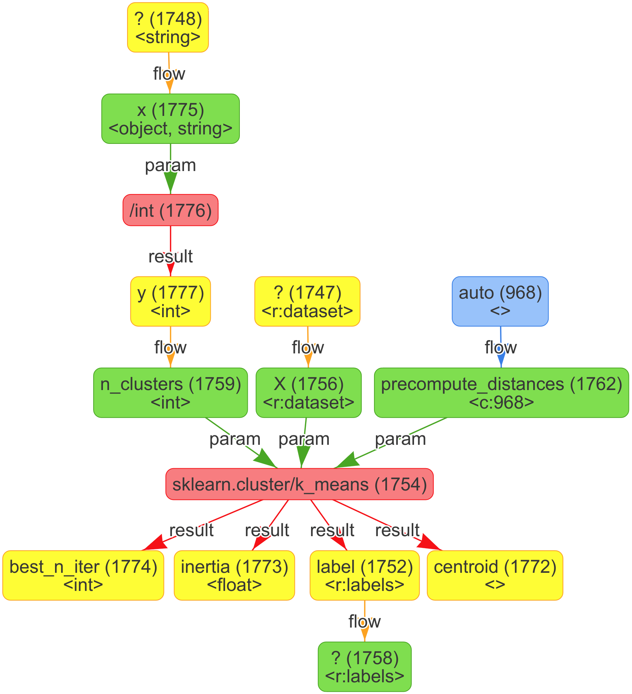

# The librarian/generator Architecture
<!--lint disable no-shortcut-reference-link-->
<!--lint disable no-undefined-references-->

The core idea of the generator is to use weighted A* to heuristically search through the space of programs that might satisfy the users requirements.
For this approach three problems had to be solved:
1. Search Space Definition
2. Action Model
3. Cost and Heuristic Model

In the following sections the solution chosen for each problem will be outlined.

## Search Space Definition

In order to search through the space of possible programs, a formal representation of those programs is needed.
One could of course represent a program directly as a code string but this representation is ill-suited for manipulation during the search since it is unstructured.
This approach would also make it difficult to use the generator for a variety of languages which was one of the task’s core requirements.

For those reasons it was chosen to represent programs as *control flow  graphs* (CFGs) instead.
To keep the complexity of those programs manageable the search space was restricted to programs without loops or conditionals, i.e. only programs consisting of a sequence of variable assignments and function or method calls.
Since many libraries can be used by performing a fixed sequence of calls, the resulting generator is still sufficiently useful for our use case despite this restriction. 
This is an exemplary generated CFG next to its equivalent Python code representation:

<table border=0>
	<tr>
		<td width="50%"></td>
		<td><pre>
import sklearn.cluster

def f(v1748, v1747):
  v968 = "auto"
  v1777 = int(x=v1748)
  v1754 = sklearn.cluster.k_means(
    X=v1747,
	n_clusters=v1777,
	precompute_distances=v968
  )
  v1752 = v1754[1]
  return v1752</pre></td>
	</tr>
</table>

1. The yellow nodes are so called `call-result` nodes.
	They represent the return values of callables, like functions, methods or constructors.
	They are also used to represent externally provided inputs to the program, e.g. the dataset.
1. The so called `call-parameter` nodes are shown in green.
	They represent the parameter values of callables and the final outputs of the generated program.
1. The red `call` nodes represent an invokation of some callable.
1. Blue `constant` nodes represent literal or enum values.

A given CFG repesents a valid program if all `call-parameter` nodes receive a value from some `call-result` or `constant` node.
Parameters that do not receive a value are considered to be flaws; they make the CFG invalid.
Only valid CFGs can be translated into executable source code.

## Action Model

Using CFGs as the search space, an action model had to be defined that allows for a systematic traversal of the space.
A trade-off had to be made between the simplicity and the expressiveness of the used actions.
Five action classes were chosen:
1. **Parameter filling:**
	Adds a `flow` edge from some value-providing node to a `call-parameter` node.
1. **Parameter removal:**
	Removes an optional `call-parameter` node.
1. **Call insertion:**
	Inserts a new `call` node which represents a call to some callable.
	For all para\-meters and return values of the callable, including the optional ones, new `call-parameter` and `call-result` nodes respectively are attached to the added `call`.
1. **Snippet insertion:**
	Inserts an entire CFG subgraph, called a snippet graph, into the current CFG.
	Those snippet graphs represent common coding patterns in a given library and are part of the library scrape that is given to the generator as an input.
	By inserting common coding patterns via a single action, the search can be sped up significantly.
	The inserted snippets can contain partially specified `call` nodes, e.g. where only the namespace and a subset of required parameters are given.
	That way classes of multiple specific CFGs can be represented by a single snippet.
1. **Call completion:**
	Completes a partially specified `call` node by replacing it with a call to a specific compatible callable.
	Partially specified `call` nodes are always the result of previously applied snippet actions or are given as part of the initial search state CFG.
	
The first two action classes reduce the number of flaws in a given CFG, i.e. they bring it closer to a solution state.
Action classes 3 and 4 increase the number of flaws in a given CFG since they introduce new potentially incomplete calls and call parameters that will have to be completed and filled before a solution is found.
Action class 5 resolves incomplete call flaws by completing calls, which in turn might entail the insertion of new call parameters from the completed callable.

The motivation behind this choice of action classes was to provide a minimal set of fundamental actions via the action classes 1, 2 and 3;
to increase the expressiveness of the model, support for snippets was added via action classes 4 and 5.
All actions were chosen to be irreversible to guarantee that the the search space graph spanned by the actions is acyclic, which is required by the chosen cost and heuristic model.

## Cost and Heuristic Model

In order to find a valid CFG efficiently, a cost model had to be developed.
To make the this model consistent, understandable and tractable some notion of cost had to be defined for the action model.
The generator uses a cost measure based on the probability that a given incomplete CFG will lead to a complete CFG that satisfies the requirements of the user.
For a given CFG $S$ and an action $a$ the probability of $P(a(S))$ is defined to be $P(S) \cdot P(a | S)$, with $P(I) = 1$ for the initial state $I$.
To transform this notion into an additive cost measure, the cost $c_{a,S}$ of $a$ is defined to be its information content $-\log P(a | S)$.
Thus the sum of action costs that lead to some state are always lowest for the most probable state.

To calculate the probabilities $P(a_i | S)$ of the set of actions $A_S := \{a_1, \dots, a_n\}$ that are applicable to some state $S$, a weight $w_i \in [0, 1]$ is assigned to each action.
Using those weights the action probabilities are defined as $P(a_i |S) := \frac{w_i}{1 + \sum_{j = 1}^{n} w_j}$.
When there is no information about the relevance of the actions, all weights $w_i$ are equal (typically $1$) and the probability distribution reduces to a uniform prior.
The constant 1 is added to the denominator to naively smooth the distribution by giving all actions that are not part of the action model a non-zero weight.
Smoothing is required to guarantee the existence of a positive lower bound on the action costs ($c_{a_i,S} \geq \log 2$).

To differentiate between the weights $w_i$ of actions, the generator uses a semantic compatibility measure.
The details of this measure are left out for brevity but the basic idea is to consider how an action affects the data flow through the CFG.\
Each node of the CFG has a set of strict and semantic types attached to it;
a strict type typically is a program datatype like `float`, a semantic type on the other hand encodes a certain meaning or interpretation of its instances.
Strict types are used to determine which actions are admissible, semantic types are used to determine their weights.
Actions that cause values to flow into parameters to which they are semantically incompatible will get a lower weight than more compatible actions.

To steer the A* search into promising directions a heuristic function $h$ is used that returns an optimistic estimate of the probability that a solution will be found, given a certain CFG.
Formally the used heuristic itself is admissible in most cases and would thus yield optimal results according to the cost measure presented above.
For performance reasons the heuristic is weighted with $w_h > 1$ since the unweighted version was too slow in practice.
Once user feedback is incorporated into the search loop as part of the interactive code generation implementation, the search space might become small enough to consider dropping the weight on the heuristic function again.
