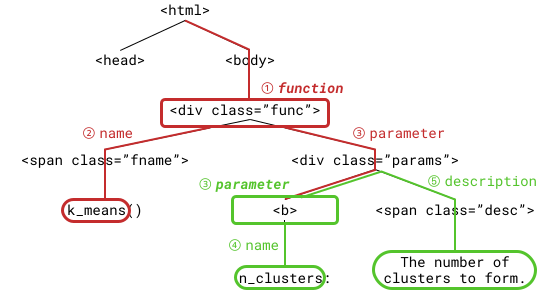

# librarian/scraper

Crawls through the documentation of software libraries and transforms them into a standardized format.
librarian-scraper is a tool that uses a scrape configuration to crawl the documentation of a software library.
The scraped information will be automatically linked, sanitized, validated and then written to a scrape database file.


**Architecture overview:** An introduction to the working principle of the scraper can be found [here](./docs/architecture.md).

## 1. Scraping a library

The scraper can be used via the unified [Librarian-CLI](../..).
To create a scrape you can run:
```shell
java -jar target/librarian.jar scrape libs/scikit-learn
```
The `scrape` command requires the path to a scrape configuration.
Librarian comes with a scrape configuration for scikit-learn at [`libs/scikit-learn/scraper.clj`](../../libs/scikit-learn/scraper.clj).
If the configuration is called `scraper.clj`, the filename can be omitted as seen above.

The resulting scrape will be written to `scrape.db` in the parent directory of the scrape configuration by default.
This can be changed by providing an output path as a second argument to `scrape`.

For debugging purposes the scraper also provides the commands `print-scrape` and `print-config` to print validated and postprocessed versions of the scrape database and configuration.

## 2. Querying a scraped library via the CLI

Despite the fact that scrapes are meant to be used programmatically via the librarian-scraper Java API, they can also be queried via the CLI for debugging and testing purposes.

librarian-scraper stores scrapes as gzipped serializations of [Datascript](https://github.com/tonsky/datascript) databases.
Those scrape databases can be queries using [Datalog](https://docs.datomic.com/on-prem/query.html) queries:
```shell
java -jar target/librarian.jar query libs/scikit-learn \
  '[:find ?name :where [?p :type :namespace] [?p :namespace/name ?name]]'
# => Prints the names of all the namespaces of scikit-learn.
```
A good introduction to Datalog can be found [here](http://www.learndatalogtoday.org/).

To see which attributes and types are available for queries, you can use the `print-schema` command:
```shell
java -jar target/librarian.jar print-schema python
# => Prints the attributes and concept types of python library scrapes.
```

Alternatively the CLI also supports so-called [pull queries](https://docs.datomic.com/on-prem/pull.html) that make it easy to perform recursive traversals through the attribute graph:
```shell
java -jar target/librarian.jar pull libs/scikit-learn \
	'[*]' '[:class/id "sklearn.cluster.KMeans"]'
# => Prints all attributes and subattributes of the KMeans class.
```

## 3. Writing your own scrape configurations

A scraper is configured via a `scraper.clj` file which has the following [EDN](https://github.com/edn-format/edn)-like structure:
```clojure
(defscraper my-library
  :ecosystem :python ; Currently only python support is provided.

  :seed "URL" ; Initial page for the library crawling.
  :should-visit #"URL regex" ; A regular expression matching the URLs that should be crawled.
  
  ;; Patterns: A map from pattern names to patterns, i.e. hook templates.
  :patterns
  {:my-pattern { ... definition of hook properties ... }}
  
  ;; Hooks: A collection of hooks to be used to extract content from crawled pages:
  :hooks
  [;; 1. Concept hooks for creating concepts:
   {:triggered-by :some-trigger ; All hooks need a trigger.
	
	:concept :some-concept
	; Alias of the concept that should be created.
	
	:selector [ ... selector definition ... ]
	; Selector to find all instances of the concept relative to the trigger.
	
	:ref-to-trigger :some-concept/my-trigger
	; Used to add a reference attribute from concepts created by this hook to their triggering concept.
	
	:ref-from-trigger :some-trigger/my-concept
	; Used to add a reference attribute from the triggering concept to the created concepts.
	
	:allow-incomplete false | true
	; Whether concepts created via this hook should be validated only after scraping all pages.
    }
   
   ;; 2. Attribute hooks to attach information to concepts: 
   {:triggered-by :some-trigger

	:attribute :some-trigger/some-attribute 
	; Alias of the attribute that should be added to the triggering concept.

	:selector [ ... selector definition ... ] 
	; Selector to find the values for the created attributes relative to the triggering concept.

	:value :content | :trigger-index | "some string" | 42
	; Controls which value is used for the created attribute.

	:transform #"value regex" | some-function 
	; A regex or function to transform the selected attribute value or to select parts of it.
	}
   
   ;; 3. General properties of hooks:
   {:triggered-by :document 
	; There needs to be at least one initial hook, that is triggered by the :document root.

 	:pattern :my-pattern
	; Hooks can inherit parts of their definition from the defined patterns.
	
	:triggers [:my-custom-trigger1 :my-custom-trigger2]
	; Hooks can also trigger custom trigger types.
	}]
  
  ;; Snippets: Predefined code patterns for the scraped library to speed up code generation.
  :snippets
  [[; A snippet is a partial control flow graph (CFG) consisting of control flow nodes
    ; with references to arbitrary concepts:
    {:type :call ; A call node describes the call to some callable (function, method, etc.).

     ; Next we describe that the call should go to some arbitrary callable in a specified namespace.
	 ; Setting :placeholder to true marks the CFG node as a proxy for a multitude 
	 ; of specific concepts that it should be replaced with:
	 :callable {:type :function
                :placeholder true
				; The underscore in the attribute name means, that a reverse reference is required 
				; between the placeholder function and namespace, i.e. the specified namespace should 
				; have a membership reference to the concept:
                :namespace/_member {:type :namespace
                                    :name "some namespace name"}}

	 ; We also require that the call accepts a parameter with a certain name:
     :parameter {:type :call-parameter
		         :parameter {:type :parameter
					         :placeholder true
							 :name "some parameter name"}}

	 ; Finally we declare that whatever the specified family of calls returns, has the
	 ; role-type :my-role. This is useful to manually state which functions return values
	 ; that can be interpreted and used in a certain way:
	 :result {:type :call-result
		      :result {:type :result
				       :placeholder true}
		      :datatype {:type :role-type
				         :id :my-role}}}
    { ... another CFG node ... }]
   [ ... another snippet ... ]])
```

A complete example configuration with this structure can be found at [`libs/scikit-learn/scraper.clj`](../../libs/scikit-learn/scraper.clj).

### 3.1. Hooks

Hooks control how content is extracted from a page.
For a formal perspective on how they work, see the [architecture description](./docs/architecture.md).
The basic idea is to overlay a concept graph represented by a Datascript database on top of the crawled DOM trees of a library.
This means that every concept and attribute value in the database is derived from some specific location in a DOM tree.

Each hook has a *trigger*, which is typically the alias of a concept.
Whenever a new concept instance is created, all the hooks with that concept as their trigger are activated.
When activated hooks then create new concepts or attribute which in turns triggers other hooks.
This recursive chain of hook activations is set off by an initial trigger `:document` at the root of the DOM tree of each crawled web page.

This is a simple example of how the concept graph overlaying a DOM tree might look like:



The hooks that produce this overlayed concept graph might look like this:
```clojure
[;; Hook 1:
 {:triggered-by :document
  :concept :function
  :selector [:descendants (and (tag :div) (class :func))]}

 ;; Hook 2:
 {:triggered-by :function
  :attribute :function/name
  :selector [:children (and (tag :span) (class :fname))]
  :value :content ; Use the text content of the selected node as the value.
  :transform #"^[a-zA-Z0-9_]+"} ; Don't include the parentheses.

 ;; Hook 3:
 {:triggered-by :function
  :concept :parameter
  :selector [:children (and (tag :div) (class :params))
             :children (tag :b)]
  :ref-from-trigger :function/parameter}

 ;; Hook 4:
 {:triggered-by :parameter
  :attribute :parameter/name
  ; The concept is already associated to the node containing the name, 
  ; thus no selector is required. The transformer is also not required here.
  :value :content}

 ;; Hook 5:
 {:triggered-by :parameter
  :attribute :parameter/description

  ; Go through all the siblings following the <b> tag and select 
  ; the first <span> with class "desc":
  :selector [[:following-siblings 
              :select (and (tag :span) (class :desc))
			  :limit 1]]

  :value :content}]
```

#### 3.1.1. Hook Keys

##### 3.1.1.1. Keys of Concept and Attribute Hooks

All hooks share a set of common keys.

| Key | Value | Description |
| :-  | :---- | :---------- |
| `:triggered-by` | A trigger, i.e. a keyword. | Each hook is activated by a certain trigger type. Usually those are the aliases of concept types or concept attributes. Whenever a concept or attribute is created, the associated hooks are triggered. Additionally for each crawled page the trigger `:document` is emitted at the root of the DOM tree. Lastly a custom trigger type can also be used to react to hooks that emit custom triggers (see `:triggers` in this table). |
| `:pattern` *(optional)* | Name of a pattern, a keyword. | Hooks can inherit parts of their definition from the defined patterns. All properties of the patterns will be copied to the hook. |
| `:selector` *(optional)* | A selector vector. | Every hook is triggered with the context of some location in the DOM tree that is traversed. For the initial `:document` trigger, the context is the root of the document. Every hook needs to describe where to find the DOM nodes that are relevant for it relative to its context. To do so a *selector vector* is used which is similar to XPath or CSS selectors. The selector can select an arbitrary amount of DOM nodes which are used to fetch textual values for attributes or they are used as the new contexts of triggered hooks. A description of the selector vector DSL is provided below. If no selector is provided, the current DOM context remains unchanged and is used for value retrieval and as the context of triggered dependent hooks. |
| `:triggers` *(optional)* | A custom trigger or a collection of custom triggers, i.e. a keyword or collection of keywords.  | Hooks can trigger custom trigger types. By default every hook only triggers the hooks that are triggered by the concept or by the attribute that was created. For more control and contextual hook activation, hooks can also trigger custom trigger types. |

##### 3.1.1.2. Keys of Concept Hooks

Concept hooks are used to create new concepts and reference attributes between them.
They create the vertices and edges in the concept graph described by the scrape database.

| Key | Value | Description |
| :-  | :---- | :---------- |
| `:concept` | The alias of a concept that should be created, a keyword. | When a concept hook is triggered, a new instance of the declared concept type will be created for each DOM node that was selected by `:selector`. |
| `:ref-from-trigger` *(optional)* | The alias of a concept reference attribute, a keyword. | Declares that a reference attribute should be created from the concept instance created by the "parent" hook that triggered the current hook to the concept instance created by the current hook. Thus the used attribute should be an attribute of the triggering hook's concept. |
| `:ref-to-trigger` *(optional)* | The alias of a concept reference attribute, a keyword. | Like `:ref-from-trigger` but with the edge direction inversed. Thus the used attribute should be an attribute of the hook's concept, defined in `:concept`. |
| `:allow-incomplete` *(optional, default: `false`)* | A boolean, `true` or `false`. | If `false`, all concepts found in a crawled page are validated right after the page was traversed. This means that all mandatory information of those concepts has to be found on a single page, which is usually the case. If the flag is set to `true`, the validation of concepts created via such a hook will be delayed to the end of the page traversal phase, after all pages were crawled. This allows combining information about a single concept from multiple pages where each page only contains a part of that concept, that would be invalid by themselves. This added flexibility has a performance and memory usage penalty, so it should only be enabled if necessary. |

##### 3.1.1.3. Keys of Attribute Hooks

Attribute hooks are used to create non-reference attributes for existing concepts.
They create the literal-value attributes/edges attached to vertices and store the actual data extracted from the crawled pages (strings, numbers etc.).

| Key | Value | Description |
| :-  | :---- | :---------- |
| `:attribute` | The alias of a attribute that should be created, a keyword. | When an attribute hook is triggered, a new  `:selector`. |
| `:value` *(optional, default: `:content`)* | `:content` or `:trigger-index` or a string or a number | Which value should be used. `:content` uses the text content of the selected DOM nodes as the attribute value. `:trigger-index` ignores the contents of the selected nodes and instead uses the ordinal position of the trigger context in the parent's selection result; this is useful to number created concepts, e.g. if `n` instances of a concept `:C` were created for a corresponding `n`-element HTML list, the created concepts can be enumerated by letting `:C` trigger an attribute hook with `:value :trigger-index` for some attribute `:C/position`. If a string or numeric literal is provided, the hook always uses this constant as the attribute value. |
| `:transform` *(optional, default: `identity`)* | A regex or a 1-arity function | Used to transform the selected values before they are written to the database. If a regex is provided, the selected raw value is matched with that regex and only the substring match is written. If there is no match, no attribute will be created. If a function is provided, any arbitrary transformation can be performed. All Clojure builtin functions can be used, everything outside of `clojure.core` has to be fully-qualified though (e.g. `clojure.string/trim`). Custom functions can be defined via the `#()` or `(fn [x])` [syntax](https://clojure.org/guides/learn/functions#_anonymous_functions). If the custom transform function returns `nil`, no attribute will be created. |

#### 3.1.2. The DOM Selector DSL

The previously described `:selector` key requires a *selector vector* which is an instance of the scraper's selector DSL.
This DSL is similar to the tree selection paradigms in CSS or XPath.

As the name suggests, a selector vector is just a vector of so-called *selectors*: `[selector1 selector2 ...]`.
Every selection starts with a set of initial DOM nodes (typically there is just one initial node).
This initial node set forms the first stage of the selection.
The selectors in a selector vector are then applied in sequence, left-to-right:
1. Apply the current selector to every DOM node in the current stage.
	This maps every node to a set of successor nodes.
2. Merge all the successor sets obtained in the previous step to form the next stage's set of DOM nodes.
3. Goto 1 with the next selector or return the newly created DOM node set if no further selectors have to be applied.

There are two types of selectors:
Traversers and filters.
A traverser performs some simple tree traversal operation on the nodes it gets and outputs all the nodes that were reached.
A filter on the other hand either outputs a node it got or no node at all.
By combining both types of selectors, complex node selection patterns can be described.

##### 3.1.2.1. Traversing Selectors

Librarian comes with the following traversers:

| Traverser | Description |
| :-------- | :---------- |
| `:children` | Maps nodes to their direct child nodes in the same order as they are in the DOM tree. |
| `:descendants` | Maps nodes to their direct and indirect descendant nodes. The descendants are returned in depth-first order. |
| `:ancestors` | Maps nodes to their direct and indirect ancestor/parent nodes. The nodes are ordered from start node to the tree root. First the start node is returned (i.e. it's its returned as its own ancestors), lastly the DOM's root node is returned. |
| `:siblings` | Maps nodes to their sibling nodes in the order they appear in the DOM. The initial node is returned as its own sibling. |
| `:following-siblings` | Maps nodes to the sibling nodes coming after it in the same order they appear in the DOM. The result includes the initial node. Useful to get to the next sibling of a node. |
| `:preceding-siblings` | Maps nodes to the sibling nodes coming before it in the reverse order they appear in the DOM. The result includes the initial node. Useful to get to the previous sibling of a node. |
| `:following` | This is the least intuitive traverser. It interprets each start node as the current state of a depth-first tree traversal and continues the traversal independently for each state node until the "rest" of the tree was traversed. In practice this means, that at first the descendants are returned, similar to `:descendants`, then the DFS-search jumps to the next sibling of the inital node and traverses the descendants of the sibling, after finally traversing all the siblings and parent's siblings, etc. the search will end at the root node of the tree. |

Each traverser can be used directly via its keyword, e.g. `[:siblings :children]` selects all the child nodes of all the siblings of the current node, including the children of the current node itself.
Alternatively a traverser can be configured with additional options by providing a *traverser vector* of the form:
```clojure
[:traverser
 :select some-boolean-function ; default (constantly true)
 :while some-boolean-function ; default (constantly true)
 :skip some-integer ; default 0
 :limit some-integer] ; default ##Inf
```
Each of those configuration parameters is optional.
-   `:select`: The result of the traverser will be filtered by the given predicate.
-   `:while`: The traverser will return nodes until it reaches some node that does not satisfy the given predicate. 
	If both `:select` and `:while` are provided, `:while` is always applied first.
-   `:skip`: Skips the first `n` result nodes after applying `:while` and/or `:select`, i.e. if `:select` filtered out the first node and `:skip` is `1`, then the first two nodes will be skipped effectively.
-   `:limit`: Limits the number of nodes that are returned by the traverser.
	The limit is applied after all the other options.
	This option is the reason why there is no traverser for `:parent` or `:next-sibling`, since those can be represented by `[:ancestors :limit 1]` and `[:next-siblings :limit 1]`.

Using traverser configuration options, more specific traversal operations can be described:
```clojure
[[:ancestors :skip 1 :limit 1]
 [:preceding-siblings :select (tag :h1) :limit 1]]
;; => Selects the first h1 heading-element that is a preceding sibling of the grandparent of the current node.
```

##### 3.1.2.2. Filtering Selectors

Filters are just boolean predicates to reduce the node set of a selection stage.
They can be used directly as a selector in a selector vector, or as predicates in `:select` or `:while` configurations of traversers.

Librarian uses the selectors that are provided by the [Hickory](https://github.com/davidsantiago/hickory#selectors) library.
Refer to the linked documentation for a full list of predicates.
The most important ones are:
-   `and`, `or`, `not` to compose predicates, e.g. `(and (not (tag :h1)) (or (class :foo) (class :bar)))`
-   `(tag :tag-name)`: Selects only nodes of the given tag.
-   `(class :class-name)`: Selects only nodes of the given class.
-   `(id :id)`: Selects only nodes with the given id.

### 3.2. Snippets

The `:snippets` section in a scraper configuration is used to define code patterns for the scraped library to speed up code generation.
