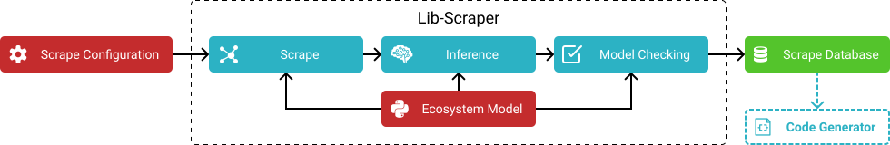

# The librarian/scraper Architecture

The configurable scraper requires a scrape configuration file as input.
Additionally it uses an [*ecosystem model*](../../model) which gives it knowledge about specific programming languages and also a general understanding of paradigms like object orientation or functional programming.
Using a scrape configuration and the ecosystem model the scraper then goes through three phases:
1. **Scraping:** First it crawls through the documentation pages of the target library and extracts relevant information from the DOM trees of those pages.
		This phase yields an initial concept graph where concepts like `class` or `method` are nodes and attributes like `class/method` or `method/name` are edges.
		The set of available concept and attribute types is provided by the ecosystem model.
1. **Inference:** The initial concept graph is then refined via basic inference.
	Using the ecosystem model the scraper will infer basic facts like $\mathit{method}(C, M) \land \mathit{name}(M, \texttt{\_\_init\_\_}) \rightarrow \mathit{constructor}(C, M)$ if a Python library is scraped.
1. **Model Checking:** After refining the concept graph in the inference phase, the scraper then validates all scraped concepts using the ecosystem model.
	Invalid concepts, e.g. a method without a name, will be removed automatically to guarantee consistency and correctness of the scrape to a certain extent.
	This final phase is important to compensate for errors and inconsistencies in documentations.
	

Now follows a short overview of the technologies and tools used.
The page crawling itself is done using the [Crawler4j](https://github.com/yasserg/crawler4j}) library.
The crawled pages are parsed using [Hickory](https://github.com/davidsantiago/hickory) and converted to Clojure [zippers](https://en.wikipedia.org/wiki/Zipper_(data_structure)), an efficient immutable datastructure to describe tree traversal states.
The scraped facts are stored in a [Datascript](https://github.com/tonsky/datascript) in-memory database;
it essentially is triple store consisting of B-tree-based covering indices.
The scraper stores the scraped facts as a gzipped [EDN](https://github.com/edn-format/edn) serialization of the Datascript database.

## Configuration of the Library Scraper

The core requirements for the scraper were that it should be flexible enough to scrape any typical library documentation while also being fairly simple to configure.
A "hook"-based configuration format was chosen to trade-off those competing requirements.
In the scraping phase those hooks are used to guide the scraper:
1. The scraper starts by creating a set of DOM trees, i.e. a DOM "forest" $\mathcal{F} = (V, E)$, by recursively crawling through all the pages that can be reached from a starting page and whose URL fits a given pattern.
	The starting page and URL pattern are given in the configuration.
	To reduce the hardware requirements, $\mathcal{F}$ will not actually be held in memory in its entirety;
	since this optimization is however not visible to the user it can be ignored for now.
	In the following $V = N_V \cup A_V$ will denote the set of DOM nodes $N_V$ and attribute values $A_V$ in all scraped pages,
	$E = N_E \cup A_E$ will denote the set of directed child edges $N_E \subseteq N_V \times N_V$ and attribute edges $A_E \subseteq N_V \times A_V$.
	Also the existence of functions that assign metadata to the nodes and edges (tag names, attribute names, child node orderings etc.) is assumed.
2. The basic working principle of the scraper is to overlay $\mathcal{F}$ with a concept graph $\mathcal{G} = (C, R)$ where $C$ is a set of concepts and $R \subseteq C \times C$ is a set of concept relations.
	More formally it finds nodes in $\mathcal{F}$ that represent concepts and builds a mapping $f: C \rightarrow V$ from concepts to DOM nodes.
	Each found concept $c$ and each relation $r$ has a type $\mathit{type}(c) \in T_C$ and $\mathit{type}(r) \in T_R$ respectively with $T := T_C \cup T_R$ being the set of all node types (e.g. `class` or `method`) and relation types (e.g. `class/method` or `method/name`).
3. To find the concepts and relations in $\mathcal{F}$ the scraper recursively applies a set of "hooks" $\mathcal{H}$ that is provided by the configuration.
	A hook $h = (t, e, s) \in \mathcal {H}$ consists of a trigger type $t \in T$ an effect type $e \in T$ and a selector function $s: (\mathcal{F}, v) \mapsto V'$ with $v \in V$ and $V' \subseteq V$.
	The selector function essentially finds a set of DOM nodes $V'$ relative to a given node $v$;
	in the configuration file $s$ is described using a DSL with an expressive power comparable to XPath.
	The application of the hooks $\mathcal{H}$ works like this:
	1. Initially an effect queue $\mathcal{Q}$ is initialized with a set of effects $\{(\texttt{document}, r)\,|\, r \textrm{ root node in } \mathcal{F}\}$.
		An effect essentially describes the arrival of new information which hooks can hook into to recursively produce new information.
		At the beginning the only available information is the existence of the crawled documents.
	2. If $\mathcal{Q}$ is not empty, the first effect $e = (t, v)$ is taken from the queue. The scraping phase is completed if $\mathcal{Q}$ is empty.
	3. All hooks $\mathcal{H}' = \{h \in \mathcal {H}\,|\, h = (t_h, e_h, s_h) \land t_h = t\}$ with trigger type $t$ are then triggered.
		For each triggered hook $h = (t, e_h, s_h) \in \mathcal{H}'$ the scraper applies $s_h(\mathcal{F}, v)$ to find a set of selected nodes $V_h$.
	4. For each selected node $v_h \in V_h$ the concept graph $\mathcal{G}$ is then extended with a new concept of type $e_h$ iff. $e_h \in T_C$ or a new relation of type $e_h$ iff. $e_h \in T_R$.
		Additionally other concept nodes or relations can be added as part of this extension of $\mathcal{G}$.
		The details of how this works is left out for the sake of brevity but the basic idea is that the scraper will extract data from $v_h$, transform it (e.g. select text using a regular expression), connect the transformed data to other nodes or use it to unify nodes via uniqueness constraints that are provided by its ecosystem model.
	5. Since the extension of the concept graph $\mathcal{G}$ produced new information, new effects have to be created.
		Each selected node $v_h \in V_h$ of each triggered hook $h \in \mathcal{H}'$ is used to add an effect $(e_h, v_h)$ to $\mathcal{Q}$.
	6. Goto 2.

Using this approach, writing a scrape configuration only requires the user to specify how to locate a certain concept or attribute relative to another concept or attribute, i.e. specifying a set of annotated XPath-like tree selectors.
